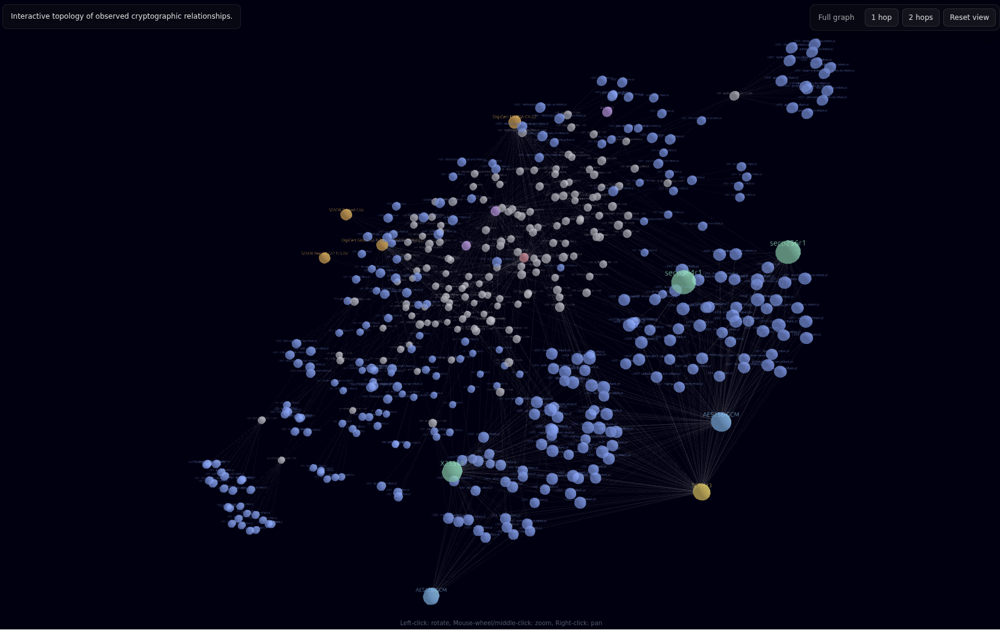

# pq-map

discovery and mapping of externally visible cryptographic identities and services using Certificate Transparency and DNS

CT estate (crt.sh certwatch DB → HTTP fallback → cache) → DNS discovery (SRV/SVCB/HTTPS, A/AAAA) → live TLS probe (rustls PQ-first, openssl fallback) → correlated text / JSON / graph output.



## Usage

```
pq-map nbp.pl                # combined text view (default)
pq-map nbp.pl --summary      # certificate estate summary
pq-map nbp.pl --hosts        # hostnames of valid certificates
pq-map nbp.pl --certs        # CT certificate records
pq-map nbp.pl --json         # full state as JSON
pq-map nbp.pl --graph        # semantic graph JSON (see visualization below)
pq-map nbp.pl --refresh      # force fresh CT + full re-probe
pq-map nbp.pl --no-probe     # CT/DNS only, no TLS handshakes
```

Caches in `~/.cache/pq-map/`: CT 7 days, probes 24 hours. DNS resolves every run and invalidates cached probes; failed probes are cached too. `--refresh` bypasses both.

## Visualization

```
./pq-graph.sh                 # serves ./graph.json on :8000, opens browser
./pq-graph.sh graph.json 9000
```

3d-force-graph viewer

## ENV vars

- `CT_DB_HOST=crt.sh`
- `CT_DB_PORT=5432`
- `CT_DB_USER=guest`
- `CT_DB_DB=certwatch`
- `CT_DB_CONNECT_TIMEOUT=30`
- `CT_DB_QUERY_TIMEOUT=120`
- `CT_CACHE_TTL=604800`
- `PROBE_CACHE_TTL=86400`
- `PROBE_TIMEOUT=8`
- `PROBE_CONCURRENCY=32`
- `DNS_TIMEOUT=5`
- `DNS_ATTEMPTS=2`
- `DNS_CONCURRENCY=32`

## Build

```
cargo build --release    # rust 1.85+, libssl-dev
cargo test
```

## License

EUPL-1.2
